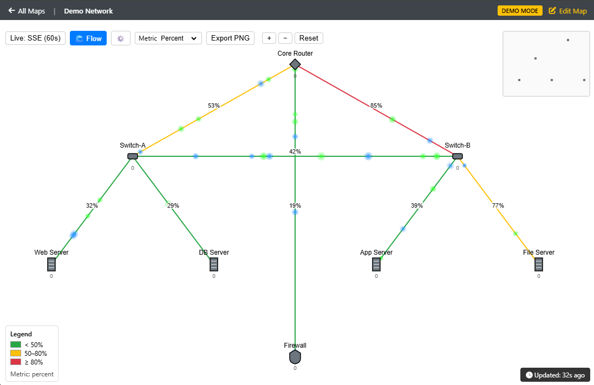

# WeathermapNG - Network Visualization for LibreNMS

A modern network weathermap plugin for LibreNMS v2 that provides real-time network topology visualization with traffic flow animations.



## Features

- **Real-time Visualization**: Live traffic data with animated flow indicators
- **Interactive Editor**: Professional map editor with device integration
- **LibreNMS-native UI**: Editor and map views styled to match LibreNMS
- **RRD-based Traffic Data**: Real-time bandwidth from LibreNMS RRD files
- **Server-Sent Events**: Live updates without polling
- **Import/Export**: JSON format for backup and sharing maps
- **Embed Support**: Embed maps in dashboards with live updates
- **Map Templates**: Built-in templates for common network topologies

## Quick Start

### One-Command Install (Recommended)

```bash
cd /opt/librenms/html/plugins
git clone https://github.com/lance0/weathermapNG.git WeathermapNG
cd WeathermapNG && ./quick-install.sh
```

The script automatically installs dependencies, sets up database tables, configures permissions, and enables the plugin.

### Manual Install

```bash
# 1. Clone and install
cd /opt/librenms/html/plugins
git clone https://github.com/lance0/weathermapNG.git WeathermapNG
cd WeathermapNG
composer install --no-dev

# 2. Setup database
php database/setup.php

# 3. Configure LibreNMS
cd /opt/librenms
php artisan cache:clear
php artisan view:clear
chown -R librenms:librenms /opt/librenms/html/plugins/WeathermapNG

# 4. Enable plugin
./lnms plugin:enable WeathermapNG
```

### Requirements

- LibreNMS (latest stable)
- PHP 8.2+
- Composer
- MySQL/MariaDB

**Access the plugin at**: `https://your-librenms/plugin/WeathermapNG`

## Getting Started

1. **Access the Plugin**: Navigate to `https://your-librenms/plugin/WeathermapNG`
2. **Create Map**: Click "Create New Map" or select a template
3. **Configure**: Enter name, title, and dimensions
4. **Design**: Use the canvas editor to add devices and connections
5. **Save**: Your map is now live with real-time traffic data

### Tips

- Use the device dropdown to populate your map automatically
- Drag nodes to position them on the canvas
- See traffic updates in real-time as you work
- Export maps as JSON for backup or sharing

### Demo Mode

Test the plugin without real LibreNMS devices:

```bash
# Enable demo mode (generates simulated traffic)
echo "WEATHERMAPNG_DEMO_MODE=true" >> /opt/librenms/.env

# Create sample network topology
php /opt/librenms/html/plugins/WeathermapNG/database/seed-demo.php
```

## Embedding Maps

```html
<iframe src="https://your-librenms/plugin/WeathermapNG/embed/1"
        width="800" height="600" frameborder="0">
</iframe>
```

## Troubleshooting

### Plugin Not Showing

```bash
cd /opt/librenms
php artisan cache:clear
php artisan view:clear
```

### Permission Errors

```bash
sudo chown -R librenms:librenms /opt/librenms/html/plugins/WeathermapNG
```

### Database Issues

```bash
cd /opt/librenms/html/plugins/WeathermapNG
php database/setup.php
```

### Maps Not Updating

- Check cron job: `crontab -u librenms -l | grep weathermap`
- Verify poller: `ps aux | grep map-poller`

## Updating

```bash
cd /opt/librenms/html/plugins/WeathermapNG
git pull
composer install --no-dev
cd /opt/librenms
php artisan cache:clear
php artisan view:clear
```

## Architecture

WeathermapNG follows a modular service-oriented architecture:

| Service | Purpose |
|---------|---------|
| NodeDataService | Node data aggregation, metrics, and traffic |
| DeviceDataService | Device status and hostname-based traffic |
| LinkDataService | Link alerts and port-level aggregation |
| PortUtilService | RRD-based traffic data for links |
| MapService | Map CRUD and JSON import/export |
| SseStreamService | Real-time Server-Sent Events streaming |

## Development

### Running Tests

```bash
composer test
```

### Code Quality

```bash
composer quality
```

## Documentation

- [Detailed Installation Guide](INSTALL.md)
- [API Documentation](API.md)
- [Embed Viewer Guide](docs/EMBED.md)
- [Configuration Reference](config/weathermapng.php)

## Contributing

Pull requests welcome. Please follow PSR-12 coding standards and include tests.

## Support

- **Issues**: [GitHub Issues](https://github.com/lance0/weathermapNG/issues)
- **Community**: [community.librenms.org](https://community.librenms.org)

## License

Unlicense - Public Domain
