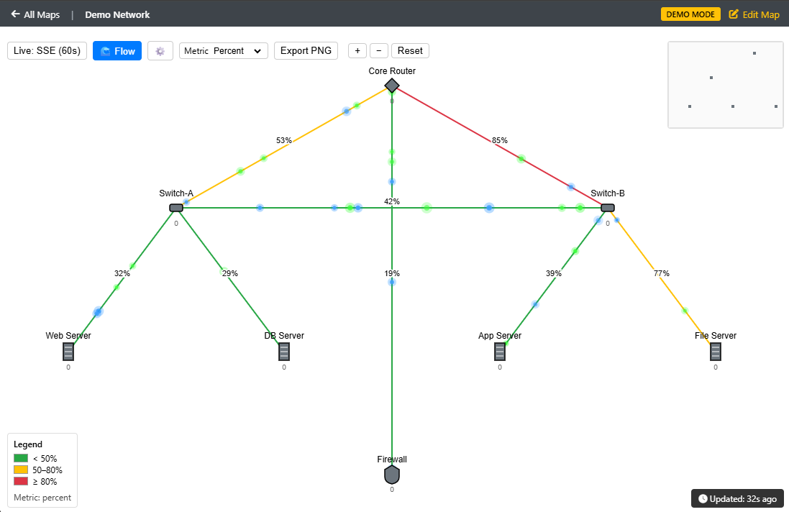
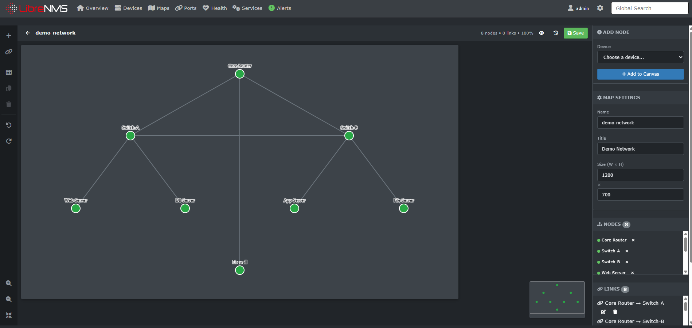

# WeathermapNG — Network Visualization for LibreNMS

A modern network weathermap plugin for LibreNMS that provides real-time network topology visualization with animated traffic flow.






## Features

- **Real-time Visualization**: Live traffic data with animated flow indicators
- **Professional Editor**: 3-panel layout with toolbox, canvas, and properties sidebar
- **Via Points & Curved Links**: Route links through intermediate waypoints with straight, angled, or Catmull-Rom curved paths
- **Zoom, Pan & Minimap**: Mouse-wheel zoom, middle-click pan, click-to-navigate minimap
- **Keyboard Shortcuts**: Ctrl+S save, Ctrl+Z/Y undo/redo, arrow nudge, Delete, +/-/0 zoom
- **Undo/Redo**: 50-state history with full node and link state tracking
- **Dark/Light Mode**: Auto-detects LibreNMS theme and matches it
- **Grid Snapping**: Toggle snap-to-grid for precise node alignment
- **RRD-based Traffic Data**: Real-time bandwidth from LibreNMS RRD files
- **Server-Sent Events**: Live updates without polling (streamed inline from the render controller)
- **Admin-Only Authorization**: All 24 mutation endpoints require admin (`hasGlobalAdmin()`, `isAdmin()`, or level ≥ 10); read endpoints are open to every authenticated user
- **Import/Export**: JSON format for backup and sharing maps
- **Embed Support**: Embed maps in dashboards with live updates
- **Map Templates**: Built-in templates for common network topologies
- **Map Versioning Foundation**: Snapshot storage and history services for map rollback workflows (routes not yet registered — see [VERSIONING.md](VERSIONING.md))

## Quick Start

### One-Command Install (Recommended)

Three commands get you running on a native LibreNMS install:

```bash
cd /opt/librenms/html/plugins
git clone https://github.com/lance0/weathermapNG.git WeathermapNG
sudo chown -R librenms:librenms /opt/librenms/html/plugins/WeathermapNG
sudo -u librenms -H bash -lc 'cd /opt/librenms/html/plugins/WeathermapNG && ./quick-install.sh'
```

The script installs dependencies, registers the Composer package with LibreNMS, sets up database tables, configures permissions, and enables the plugin. Run it as the `librenms` user — running as root can leave root-owned Composer files behind.

### Docker

A Docker-based install is available for development and testing. See [INSTALL.md](INSTALL.md) for the full Docker setup.

### Demo Mode

Try the plugin without real LibreNMS devices — demo mode generates smooth, deterministic simulated traffic (per-id sine waves, jitter-free):

```bash
echo "WEATHERMAPNG_DEMO_MODE=true" >> /opt/librenms/.env
php /opt/librenms/html/plugins/WeathermapNG/database/seed-demo.php
```

See [INSTALL.md](INSTALL.md) for details and sample topologies.

### First Map

1. **Open the plugin** at `https://your-librenms/plugin/WeathermapNG`
2. **Create a map** — click "Create New Map" or pick a template
3. **Configure** the name, title, and dimensions
4. **Design** in the canvas editor: add devices from the right sidebar, drag to position, draw links between nodes
5. **Save** — your map is live with real-time traffic data

### Requirements

- LibreNMS (latest stable)
- PHP 8.2+
- Composer
- MySQL/MariaDB

## Embedding

Drop a map into any dashboard with an iframe:

```html
<iframe src="https://your-librenms/plugin/WeathermapNG/embed/1"
        width="800" height="600" frameborder="0">
</iframe>
```

Optional query parameters: `metric` (`percent`/`in`/`out`/`sum`), `sse=0` (force polling), `nav=0` (disable pan/zoom), `scale=bytes`. See the [Embed Viewer Guide](docs/EMBED.md).

## Troubleshooting

### Plugin Not Showing

```bash
cd /opt/librenms
php artisan route:list | grep -iE 'weathermap|wmng'
php artisan cache:clear
php artisan view:clear
```

If no WeathermapNG routes are listed, register the plugin as a Composer path package:

```bash
cd /opt/librenms
composer config repositories.weathermapng '{"type":"path","url":"html/plugins/WeathermapNG","options":{"symlink":true}}'
FORCE=1 composer require 'librenms/weathermapng:*' --with-dependencies --no-interaction
php artisan package:discover
php artisan optimize:clear
php artisan config:clear
```

LibreNMS `validate.php` may report `wmng_*` tables as extra tables — those belong to WeathermapNG and should not be dropped. It may also report `utf8mb4_bin` collation warnings on JSON-backed columns such as `wmng_map_templates.config`, `wmng_nodes.meta`, `wmng_maps.options`, and `wmng_links.style`; those are expected for the current schema.

If an older install left duplicate `WeathermapNG` rows in LibreNMS' `plugins` table, rerun `quick-install.sh` or `php database/setup.php` as the `librenms` user — both normalize plugin registration and remove stale duplicates.

### Permission Errors

```bash
sudo chown -R librenms:librenms /opt/librenms/html/plugins/WeathermapNG
```

### Maps Not Updating

- Verify the map has valid device and port associations.
- Check that the LibreNMS user can read the relevant RRD files.
- If you use the optional poller (`bin/map-poller.php`), check its cron entry and logs.
- Use demo mode to separate rendering issues from live data issues.

More troubleshooting in [INSTALL.md](INSTALL.md).

## Updating

```bash
cd /opt/librenms/html/plugins/WeathermapNG
git pull
composer install --no-dev --optimize-autoloader
php database/setup.php
cd /opt/librenms
FORCE=1 composer require 'librenms/weathermapng:*' --with-dependencies --no-interaction
php artisan package:discover
php artisan optimize:clear
php artisan route:clear
php artisan view:clear
php artisan config:clear
php artisan cache:clear
php artisan route:list | grep -iE 'weathermap|wmng'
```

## Documentation

- [Installation Guide](INSTALL.md) — detailed setup, Docker, demo mode, and troubleshooting
- [Deployment Guide](DEPLOYMENT.md)
- [API Documentation](API.md)
- [Embed Viewer Guide](docs/EMBED.md)
- [Performance Notes](PERFORMANCE.md)
- [Roadmap](ROADMAP.md)
- [Release Notes](RELEASE.md)
- [Versioning Guide](VERSIONING.md)
- [Contributing](CONTRIBUTING.md)

## Architecture

WeathermapNG follows a modular service-oriented architecture:

| Service | Purpose |
|---------|---------|
| NodeDataService | Node data aggregation, metrics, and traffic |
| DeviceDataService | Device status and hostname-based traffic |
| LinkDataService | Link alerts and port-level aggregation |
| PortUtilService | RRD-based traffic data for links |
| MapService | Map CRUD and JSON import/export |
| MapVersionService | Version snapshot storage (foundation — routes not yet registered) |
| RenderController | Live rendering and inline Server-Sent Events streaming |

SSE is handled inline in `RenderController::sse` — there is no separate streaming service.

## Development

### Running Tests

```bash
vendor/bin/phpunit
```

### Docker Test Suite

```bash
./tests/docker-test.sh
```

### Installation Tests

```bash
./tests/install-test.sh
```

## Contributing

Pull requests welcome. Please follow PSR-12 coding standards and include tests.

## Support

- **Issues**: [GitHub Issues](https://github.com/lance0/weathermapNG/issues)
- **Community**: [community.librenms.org](https://community.librenms.org)

## License

MIT License — see [LICENSE](LICENSE)
